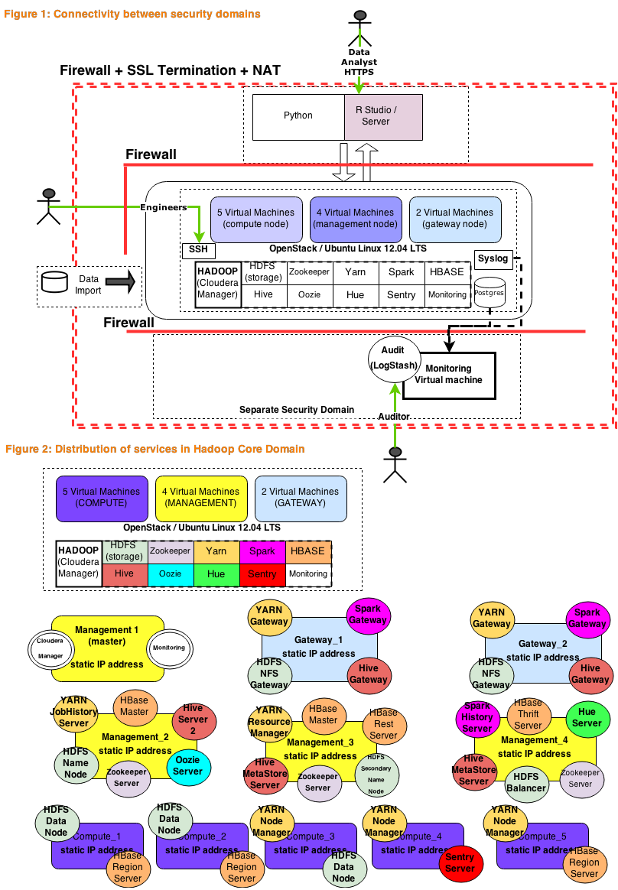
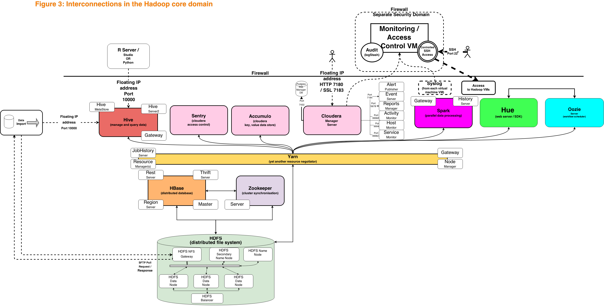
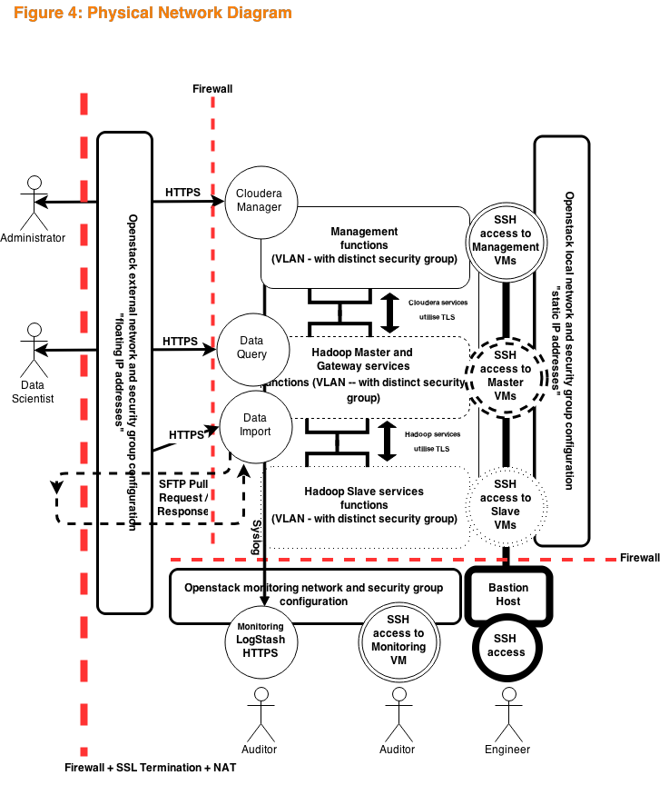
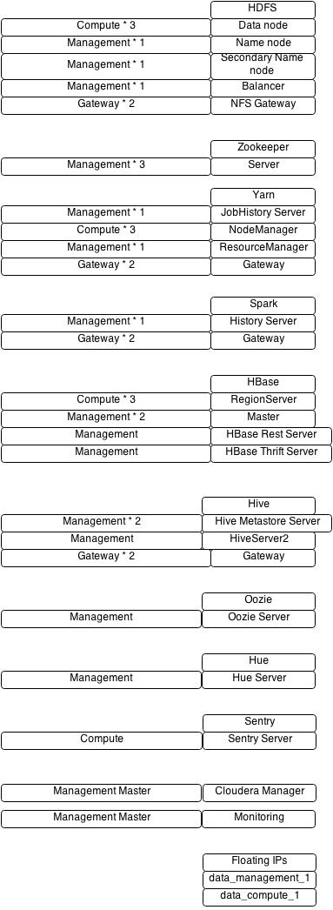

This document "captures" the Cloudera/Hadoop service distribution, which was in place **prior** to Hortonworks being adopted.

#### Connectivity and Distribution of Hadoop Services

#### Interconnections in Hadoop Services

#### Physical Network Diagram

#### Which Hadoop Service on "what fir Cloudera / Hadoop Cluster

Installing Hadoop service dependencies involves adding the appropriate services to the relevant hosts.

#### Physical Network Diagram

